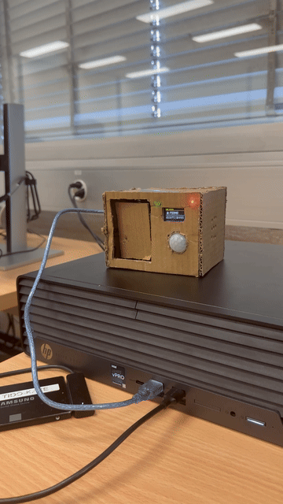
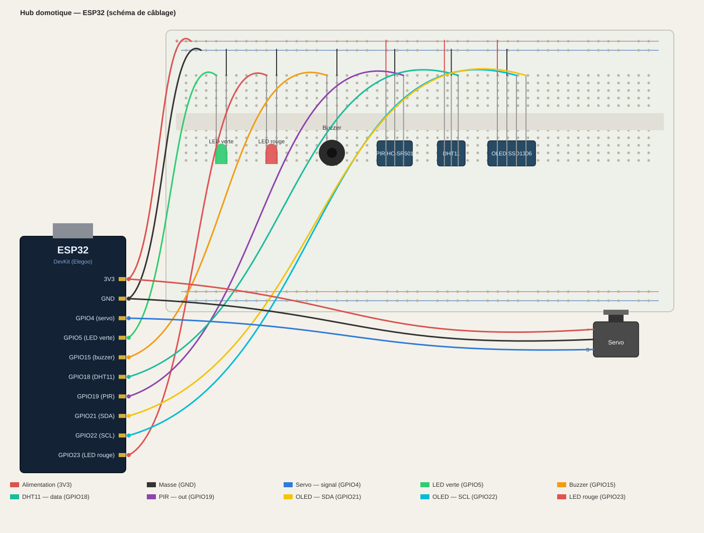

# Hub Domotique — ESP32

Hub de contrôle d'accès à base d'ESP32 : détection de mouvement, ouverture automatique (servo), affichage d'état sur écran OLED, et dashboard web temps réel pour supervision et pilotage à distance.

## Fonctionnalités

- **Détection de présence** via capteur PIR → ouverture automatique du loquet
- **Verrou motorisé** (servomoteur) piloté à distance ou automatiquement
- **Affichage local** sur écran OLED (état porte, température, humidité)
- **Indicateurs visuels** (LED verte = ouvert, LED rouge = fermé) + signal sonore (buzzer)
- **Mesure température / humidité** en continu (DHT11)
- **Dashboard web embarqué** (serveur HTTP sur l'ESP32) : consultation en temps réel et ouverture manuelle depuis un navigateur, sur le réseau local

## Matériel utilisé

| Composant              | Rôle                          | Broche ESP32 |
|-------------------------|-------------------------------|--------------|
| ESP32 DevKit (Elegoo)   | Microcontrôleur / Wi-Fi       | —            |
| Capteur PIR (HC-SR501)  | Détection de mouvement        | GPIO19       |
| Servomoteur             | Verrouillage / déverrouillage | GPIO4        |
| LED verte               | Indicateur "ouvert"           | GPIO5        |
| LED rouge               | Indicateur "fermé"            | GPIO23       |
| Buzzer                  | Signal sonore                 | GPIO15       |
| DHT11                   | Température / humidité        | GPIO18       |
| Écran OLED SSD1306      | Affichage local (I2C)         | SDA 21 / SCL 22 |

## Schéma de câblage

## Dashboard web

Une fois connecté au Wi-Fi, l'ESP32 héberge une page web accessible depuis n'importe quel appareil du réseau local (`http://<IP_DE_L_ESP32>/`), affichant :

- l'état de la porte (ouverte / fermée) en temps réel
- la température et l'humidité actuelles
- un bouton pour déclencher l'ouverture manuellement

## Installation

1. Cloner ce dépôt
2. Ouvrir le projet dans l'IDE Arduino (ou PlatformIO)
3. Installer les bibliothèques nécessaires :
   - `Adafruit SSD1306`
   - `Adafruit GFX`
   - `ESP32Servo`
   - `DHT sensor library`
4. Renseigner votre SSID et mot de passe Wi-Fi dans `HubDomotique/HubDomotique.ino` (variables `ssid` et `password`) — ne jamais committer vos vrais identifiants
5. Câbler les composants selon le schéma ci-dessus
6. Compiler et téléverser sur l'ESP32
7. Récupérer l'adresse IP affichée dans le moniteur série et l'ouvrir dans un navigateur

## Fonctionnement

0. Au démarrage, prévoir environ **1 minute de stabilisation du PIR** : le capteur déclenche des faux positifs tant qu'il n'est pas calibré, ignorer les premières détections
1. Le PIR détecte un mouvement → la porte s'ouvre automatiquement (servo), la LED verte s'allume, le buzzer bipe, l'écran OLED affiche "OUVERT"
2. Après quelques secondes, la porte se referme automatiquement (LED rouge, écran mis à jour)
3. La température et l'humidité sont relevées en continu et affichées sur l'OLED et le dashboard
4. Une ouverture manuelle est possible à tout moment depuis le dashboard web
